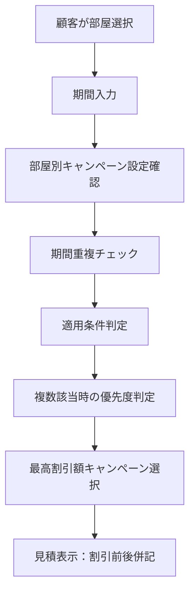
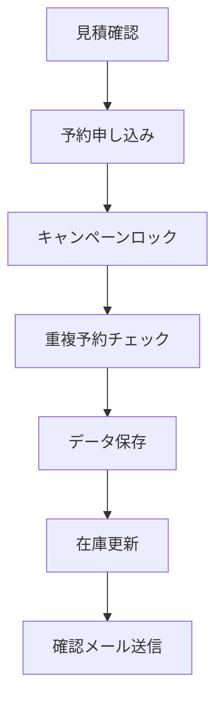

# 部屋単位キャンペーン適用管理システム 設計仕様書

**Version: 1.0**  
**作成日: 2025年8月7日**  
**対象システム: Monthly Booking WordPress Plugin**

---

## 📋 概要

- **対象**: 部屋単位でのキャンペーン適用管理
- **利用者**: 不動産の予約管理・営業担当・顧客向けWebシステム
- **基本ルール**: 1期間内に1部屋1キャンペーン（併用NG）
- **自動選択**: 条件重複時は最も割引額が高いものを自動適用

---

## 1. キャンペーンの運用ルール（開発者・現場両方向け）

### 1.1 基本原則

#### 排他適用ルール
- **同一期間・同一部屋**: 最大1つのキャンペーンのみ適用
- **異なる期間**: 同一部屋でも複数キャンペーン適用可能
- **自動選択**: 条件重複時は最も割引額が高いものを自動適用
- **事前登録**: キャンペーンは部屋単位で事前にUIフラグ登録必須

#### 期間管理の考え方
```
部屋A: [キャンペーン1: 1/1-1/31] [キャンペーン2: 2/1-2/28] ← OK（期間が異なる）
部屋A: [キャンペーン1: 1/1-1/31] [キャンペーン2: 1/15-2/15] ← NG（期間重複）
```

### 1.2 適用優先順位

キャンペーン条件が重複した場合の自動選択順位：

1. **コミコミ10万円**: 7-10日滞在（最高優先度・定額料金）
2. **即入居割**: チェックイン7日以内（20%割引）
3. **早割**: チェックイン30日以上前（10%割引）

### 1.3 運用フロー

#### 開発者向け実装ルール
```php
// 部屋別キャンペーン取得の基本パターン
function get_room_applicable_campaigns($room_id, $checkin_date, $checkout_date) {
    // 1. 部屋別キャンペーン設定を取得
    // 2. 期間重複チェック
    // 3. 適用条件判定（日数、事前予約期間）
    // 4. 優先度順ソート（割引額降順）
    // 5. 最高優先度1件のみ返却
    return $highest_priority_campaign;
}
```

#### 現場スタッフ向け操作ルール
1. **キャンペーン設定**: 管理画面で部屋別にキャンペーンを割当
2. **期間確認**: 既存キャンペーンとの重複をシステムが自動チェック
3. **顧客説明**: 「この部屋・この期間で最もお得なキャンペーンを自動適用」
4. **予約確定**: 予約時点でキャンペーン内容をロック（変更不可）

---

## 2. データモデル（キャンペーン情報・部屋情報との関連設計）

### 2.1 現在のテーブル構造

#### wp_monthly_campaigns（統一キャンペーンマスタ）
```sql
CREATE TABLE wp_monthly_campaigns (
    id mediumint(9) NOT NULL AUTO_INCREMENT,
    campaign_name varchar(255) NOT NULL,
    type varchar(50) NOT NULL,                    -- immediate/earlybird/flatrate
    discount_type varchar(20) NOT NULL,           -- percentage/fixed/flatrate
    discount_value decimal(10,2) NOT NULL,
    start_date date NOT NULL,
    end_date date NOT NULL,
    target_plan varchar(50) DEFAULT 'ALL',        -- SS/S/M/L/ALL
    applicable_rooms text,                        -- 対象部屋ID（カンマ区切り）
    is_active tinyint(1) DEFAULT 1,
    created_at datetime DEFAULT CURRENT_TIMESTAMP,
    PRIMARY KEY (id)
);
```

#### wp_monthly_rooms（部屋マスタ）
```sql
CREATE TABLE wp_monthly_rooms (
    id mediumint(9) NOT NULL AUTO_INCREMENT,
    room_id int(11) UNIQUE,                       -- 実際の主キー
    property_id int(11),
    room_name varchar(100) NOT NULL,
    daily_rent int(11),                           -- 日割賃料（固定）
    max_occupants int(3) DEFAULT 1,
    is_active tinyint(1) DEFAULT 1,
    PRIMARY KEY (id),
    KEY room_id (room_id)
);
```

### 2.2 部屋単位キャンペーン管理の拡張設計

#### 新テーブル: wp_monthly_room_campaigns（部屋別キャンペーン割当）
```sql
CREATE TABLE wp_monthly_room_campaigns (
    id mediumint(9) NOT NULL AUTO_INCREMENT,
    room_id mediumint(9) NOT NULL,
    campaign_id mediumint(9) NOT NULL,
    start_date date NOT NULL,
    end_date date NOT NULL,
    is_active tinyint(1) DEFAULT 1,
    created_at datetime DEFAULT CURRENT_TIMESTAMP,
    updated_at datetime DEFAULT CURRENT_TIMESTAMP ON UPDATE CURRENT_TIMESTAMP,
    PRIMARY KEY (id),
    UNIQUE KEY room_campaign_period (room_id, start_date, end_date),
    KEY room_id (room_id),
    KEY campaign_id (campaign_id),
    FOREIGN KEY (room_id) REFERENCES wp_monthly_rooms(room_id),
    FOREIGN KEY (campaign_id) REFERENCES wp_monthly_campaigns(id)
);
```

#### データベース制約による排他制御
```sql
-- 同一期間・同一部屋での重複防止
UNIQUE KEY room_campaign_period (room_id, start_date, end_date)

-- キャンペーン適用期間の整合性チェック
CHECK (start_date < end_date)
CHECK (start_date >= (SELECT start_date FROM wp_monthly_campaigns WHERE id = campaign_id))
CHECK (end_date <= (SELECT end_date FROM wp_monthly_campaigns WHERE id = campaign_id))
```

### 2.3 予約データとの関連

#### wp_monthly_bookings（予約データ）への追加
```sql
ALTER TABLE wp_monthly_bookings 
ADD COLUMN applied_campaign_id mediumint(9) DEFAULT NULL,
ADD COLUMN campaign_discount_amount decimal(10,2) DEFAULT 0,
ADD COLUMN original_daily_rent decimal(10,2) NOT NULL,
ADD KEY applied_campaign_id (applied_campaign_id);
```

---

## 3. 業務フロー（見積・予約・キャンペーン自動適用処理）

### 3.1 見積フロー



#### 3.1.1 詳細ステップ
1. **部屋選択**: 顧客が希望部屋を選択
2. **期間入力**: チェックイン・チェックアウト日入力
3. **キャンペーン判定**: 
   - `wp_monthly_room_campaigns`から該当部屋のキャンペーンを取得
   - 期間重複チェック（予約期間とキャンペーン期間の重複判定）
   - 適用条件判定（滞在日数、事前予約期間）
4. **排他制御**: 複数該当時は最高割引額を自動選択
5. **見積表示**: 割引前後の料金を併記表示

### 3.2 予約確定フロー



#### 3.2.1 詳細ステップ
1. **キャンペーンロック**: 予約時点のキャンペーン内容を`applied_campaign_id`に固定
2. **重複防止**: 同期間・同部屋の重複予約チェック
3. **データ保存**: 
   - `wp_monthly_bookings`に予約データ保存
   - `applied_campaign_id`でキャンペーン情報を記録
   - `original_daily_rent`で割引前料金を保存
4. **在庫更新**: 該当期間の部屋在庫を予約済みに変更

### 3.3 自動適用ロジック

#### 3.3.1 キャンペーン判定アルゴリズム
```php
function get_room_applicable_campaigns($room_id, $checkin_date, $stay_days) {
    global $wpdb;
    
    // 1. 部屋別キャンペーン設定を取得
    $room_campaigns = $wpdb->get_results($wpdb->prepare("
        SELECT c.*, rc.start_date as room_start, rc.end_date as room_end
        FROM wp_monthly_campaigns c
        INNER JOIN wp_monthly_room_campaigns rc ON c.id = rc.campaign_id
        WHERE rc.room_id = %d 
        AND rc.is_active = 1 
        AND c.is_active = 1
        AND %s BETWEEN rc.start_date AND rc.end_date
    ", $room_id, $checkin_date));
    
    // 2. 適用条件判定
    $applicable_campaigns = [];
    $days_until_checkin = (strtotime($checkin_date) - time()) / (60 * 60 * 24);
    
    foreach ($room_campaigns as $campaign) {
        $is_applicable = false;
        
        switch ($campaign->type) {
            case 'immediate':
                $is_applicable = ($days_until_checkin <= 7);
                break;
            case 'earlybird':
                $is_applicable = ($days_until_checkin >= 30);
                break;
            case 'flatrate':
                $is_applicable = ($stay_days >= 7 && $stay_days <= 10);
                break;
        }
        
        if ($is_applicable) {
            $campaign->calculated_discount = calculate_discount_amount($campaign, $stay_days);
            $applicable_campaigns[] = $campaign;
        }
    }
    
    // 3. 優先度順ソート（割引額降順）
    usort($applicable_campaigns, function($a, $b) {
        return $b->calculated_discount <=> $a->calculated_discount;
    });
    
    // 4. 最高優先度1件を返却
    return !empty($applicable_campaigns) ? $applicable_campaigns[0] : null;
}
```

---

## 4. 禁止事項とその背景／対策ルール

### 4.1 禁止パターンと代替策

| 禁止項目 | 理由 | 代替策 | 実装方法 |
|----------|------|--------|----------|
| **複数キャンペーン併用** | トラブルの原因、計算複雑化 | 自動で最もお得な1件を選ぶ排他適用 | UNIQUE制約 + 優先度ロジック |
| **キャンペーンごとの単価設定** | 単価の不整合、管理困難 | 単価は固定、割引率で調整 | daily_rent固定 + discount_value変動 |
| **複数キャンペーン手動割当** | 入力ミスの温床、運用破綻 | UIで1つだけ選択可能に制御 | ラジオボタン + JavaScript制御 |
| **営業裁量による割引率変更** | 管理が破綻、不公平感 | 10%/20%/30%など定型テンプレのみ許可 | 選択肢固定 + バリデーション |
| **細かすぎる日付設定** | 自動化・説明不可、運用困難 | 期間は週単位・月単位で明確に定義 | 期間テンプレート選択 |
| **終了後キャンペーンの表示** | 顧客誤解の原因、クレーム発生 | 適用中/予約中のもののみ明示 | WHERE is_active=1 AND end_date>=NOW() |
| **予約後のキャンペーン変更** | クレームになる、信頼失墜 | 予約時のキャンペーンはロック | applied_campaign_id固定 |
| **手動設定忘れ** | 属人化の原因、機会損失 | UIフラグとデフォルト適用を併用 | 自動適用 + 管理画面確認 |

### 4.2 技術的制約

#### 4.2.1 データベース制約
```sql
-- 同一期間・同一部屋での重複防止
UNIQUE KEY room_campaign_period (room_id, start_date, end_date)

-- キャンペーン適用期間の整合性チェック
CHECK (start_date < end_date)
CHECK (end_date <= (SELECT end_date FROM wp_monthly_campaigns WHERE id = campaign_id))

-- 割引値の妥当性チェック
CHECK (discount_value > 0)
CHECK (discount_type = 'percentage' AND discount_value <= 100 OR discount_type != 'percentage')
```

#### 4.2.2 アプリケーション制約
```php
// 1回の見積で1キャンペーンのみ適用
function apply_single_campaign_only($room_id, $period) {
    $campaign = get_room_applicable_campaigns($room_id, $period);
    return $campaign ? [$campaign] : [];
}

// 予約確定後のキャンペーン変更禁止
function prevent_campaign_change_after_booking($booking_id) {
    $booking = get_booking($booking_id);
    if ($booking->status !== 'pending') {
        throw new Exception('予約確定後はキャンペーンを変更できません');
    }
}

// 管理者権限でのみキャンペーン設定変更可能
function require_admin_permission() {
    if (!current_user_can('manage_options')) {
        wp_die('キャンペーン設定の変更には管理者権限が必要です');
    }
}
```

### 4.3 運用制約とガイドライン

#### 4.3.1 現場スタッフ向けルール
1. **キャンペーン説明**: 「部屋ごと・期間ごとに最適なキャンペーンを自動適用」
2. **重複説明**: 「複数のキャンペーンは併用できません」
3. **変更不可説明**: 「予約確定後はキャンペーン内容を変更できません」
4. **期間明示**: 「キャンペーン適用期間を明確に説明」

#### 4.3.2 システム管理者向けルール
1. **期間設定**: 週単位・月単位での期間設定を推奨
2. **重複チェック**: 新規キャンペーン作成時の重複確認必須
3. **テスト運用**: 本番適用前の十分なテスト期間確保
4. **バックアップ**: キャンペーン設定変更前のデータバックアップ

---

## 5. UIの想定設計（キャンペーン設定・見積表示・予約適用）

### 5.1 管理画面：部屋別キャンペーン設定

#### 5.1.1 キャンペーン一覧画面
```html
<div class="campaign-management">
    <h2>キャンペーン管理</h2>
    
    <!-- フィルタ機能 -->
    <div class="campaign-filters">
        <select id="room-filter">
            <option value="">全部屋</option>
            <option value="101">立川マンスリー101号室</option>
            <option value="102">立川マンスリー102号室</option>
        </select>
        <select id="status-filter">
            <option value="">全ステータス</option>
            <option value="active">有効</option>
            <option value="inactive">無効</option>
        </select>
        <input type="date" id="period-filter" placeholder="期間で絞り込み">
    </div>
    
    <!-- キャンペーン一覧テーブル -->
    <table class="campaign-list">
        <thead>
            <tr>
                <th>キャンペーン名</th>
                <th>タイプ</th>
                <th>割引率</th>
                <th>適用期間</th>
                <th>対象部屋数</th>
                <th>ステータス</th>
                <th>操作</th>
            </tr>
        </thead>
        <tbody>
            <tr>
                <td><strong>即入居割20%</strong></td>
                <td><span class="badge immediate">即入居割</span></td>
                <td>20%</td>
                <td>2025-01-01 ～ 2025-12-31</td>
                <td>5部屋</td>
                <td><span class="status active">有効</span></td>
                <td>
                    <button onclick="editCampaign(1)">編集</button>
                    <button onclick="assignRooms(1)">部屋割当</button>
                </td>
            </tr>
        </tbody>
    </table>
</div>
```

#### 5.1.2 部屋別キャンペーン割当画面
```html
<div class="room-campaign-assignment">
    <h3>部屋別キャンペーン割当</h3>
    
    <!-- 部屋選択 -->
    <div class="room-selection">
        <h4>対象部屋選択</h4>
        <div class="room-grid">
            <label class="room-item">
                <input type="radio" name="selected_room" value="101">
                <span class="room-info">
                    <strong>立川マンスリー101号室</strong>
                    <small>日割賃料: ¥2,600/日</small>
                </span>
            </label>
            <label class="room-item">
                <input type="radio" name="selected_room" value="102">
                <span class="room-info">
                    <strong>立川マンスリー102号室</strong>
                    <small>日割賃料: ¥2,800/日</small>
                </span>
            </label>
        </div>
    </div>
    
    <!-- 期間設定 -->
    <div class="period-setting">
        <h4>適用期間設定</h4>
        <div class="period-inputs">
            <label>
                開始日: <input type="date" id="campaign_start_date" required>
            </label>
            <label>
                終了日: <input type="date" id="campaign_end_date" required>
            </label>
        </div>
        
        <!-- 重複チェック結果表示 -->
        <div id="overlap-check-result" class="notice" style="display: none;">
            <p class="warning">⚠️ この期間は既に別のキャンペーンが設定されています</p>
            <ul id="overlapping-campaigns"></ul>
        </div>
    </div>
    
    <!-- 現在の割当状況 -->
    <div class="current-assignments">
        <h4>現在の割当状況</h4>
        <table class="room-campaign-table">
            <thead>
                <tr>
                    <th>部屋名</th>
                    <th>現在のキャンペーン</th>
                    <th>適用期間</th>
                    <th>操作</th>
                </tr>
            </thead>
            <tbody>
                <tr>
                    <td>立川マンスリー101号室</td>
                    <td>即入居割20%</td>
                    <td>2025-01-01 ～ 2025-12-31</td>
                    <td>
                        <button onclick="editRoomCampaign(101)">編集</button>
                        <button onclick="removeRoomCampaign(101)" class="danger">解除</button>
                    </td>
                </tr>
            </tbody>
        </table>
    </div>
</div>
```

### 5.2 顧客向け見積画面

#### 5.2.1 キャンペーン表示
```html
<div class="estimate-result">
    <h3>お見積り結果</h3>
    
    <!-- 基本料金表示 -->
    <div class="price-breakdown">
        <div class="base-price-section">
            <h4>基本料金</h4>
            <div class="price-item">
                <span class="label">日割賃料（割引前）:</span>
                <span class="amount">¥2,600/日</span>
            </div>
            <div class="price-item">
                <span class="label">滞在日数:</span>
                <span class="amount">10日間</span>
            </div>
            <div class="price-item subtotal">
                <span class="label">小計:</span>
                <span class="amount">¥26,000</span>
            </div>
        </div>
        
        <!-- キャンペーン割引表示 -->
        <div class="campaign-discount-section">
            <div class="campaign-badge">
                <span class="badge immediate">即入居割</span>
                <span class="discount-rate">20%OFF適用</span>
            </div>
            <div class="discount-calculation">
                <div class="price-item discount">
                    <span class="label">キャンペーン割引:</span>
                    <span class="amount">-¥5,200</span>
                </div>
                <div class="price-item final">
                    <span class="label">適用後日割賃料:</span>
                    <span class="amount highlight">¥2,080/日</span>
                </div>
            </div>
        </div>
        
        <!-- 最終料金 -->
        <div class="final-price-section">
            <div class="price-item total">
                <span class="label">賃料合計:</span>
                <span class="amount">¥20,800</span>
            </div>
        </div>
    </div>
    
    <!-- キャンペーン詳細説明 -->
    <div class="campaign-details">
        <h4>適用キャンペーン詳細</h4>
        <div class="campaign-info">
            <p><strong>即入居割（20%OFF）</strong></p>
            <p>チェックイン7日以内のご予約で賃料・共益費が20%割引になります。</p>
            <p class="note">※予約確定後はキャンペーン内容の変更はできません。</p>
        </div>
    </div>
</div>
```

#### 5.2.2 キャンペーン適用条件の表示
```html
<div class="campaign-conditions">
    <h4>キャンペーン適用条件</h4>
    <div class="condition-list">
        <div class="condition-item met">
            <span class="icon">✓</span>
            <span class="text">チェックイン7日以内: 3日後 ✓</span>
        </div>
        <div class="condition-item met">
            <span class="icon">✓</span>
            <span class="text">対象プラン: SSプラン ✓</span>
        </div>
        <div class="condition-item met">
            <span class="icon">✓</span>
            <span class="text">対象部屋: 立川マンスリー101号室 ✓</span>
        </div>
    </div>
</div>
```

### 5.3 予約確認画面

#### 5.3.1 キャンペーン適用確認
```html
<div class="booking-confirmation">
    <h3>予約内容確認</h3>
    
    <!-- キャンペーン適用内容の確認 -->
    <div class="campaign-confirmation">
        <div class="campaign-lock-notice">
            <h4>🔒 キャンペーン適用内容</h4>
            <p class="lock-message">
                以下のキャンペーンが適用されます。予約確定後は変更できませんのでご確認ください。
            </p>
        </div>
        
        <div class="applied-campaign">
            <div class="campaign-summary">
                <span class="badge immediate">即入居割</span>
                <span class="discount-info">20%OFF（-¥5,200）</span>
            </div>
            <div class="campaign-period">
                <small>適用期間: 2025-01-01 ～ 2025-12-31</small>
            </div>
        </div>
        
        <div class="final-pricing">
            <table class="pricing-table">
                <tr>
                    <td>基本賃料（10日間）</td>
                    <td>¥26,000</td>
                </tr>
                <tr class="discount-row">
                    <td>即入居割（20%OFF）</td>
                    <td>-¥5,200</td>
                </tr>
                <tr class="total-row">
                    <td><strong>賃料合計</strong></td>
                    <td><strong>¥20,800</strong></td>
                </tr>
            </table>
        </div>
    </div>
</div>
```

---

## 6. 将来的な拡張性も考慮した構造コメント

### 6.1 拡張可能な設計要素

#### 6.1.1 キャンペーンタイプの追加
- **現在**: immediate（即入居割）, earlybird（早割）, flatrate（コミコミ10万円）
- **将来**: seasonal（季節割）, loyalty（リピーター割）, group（団体割）, weekday（平日割）
- **実装方法**: type列の値追加 + 対応する判定ロジック追加

```php
// 拡張例: 季節割キャンペーン
case 'seasonal':
    $current_month = date('n');
    $is_applicable = in_array($current_month, [12, 1, 2]); // 冬季限定
    break;

// 拡張例: リピーター割
case 'loyalty':
    $previous_bookings = get_customer_booking_count($customer_id);
    $is_applicable = ($previous_bookings >= 3);
    break;
```

#### 6.1.2 複雑な適用条件
- **現在**: 日数ベース、事前予約期間ベース
- **将来**: 曜日指定、連泊数、利用者属性、予約経路、天候条件
- **実装**: campaign_conditions JSONフィールド追加

```sql
ALTER TABLE wp_monthly_campaigns 
ADD COLUMN campaign_conditions JSON DEFAULT NULL;

-- 例: 平日限定キャンペーン
{
  "weekdays_only": true,
  "excluded_dates": ["2025-12-29", "2025-12-30", "2025-12-31"],
  "min_consecutive_nights": 7,
  "max_occupants": 2,
  "booking_channels": ["web", "phone"],
  "weather_conditions": ["sunny", "cloudy"]
}
```

#### 6.1.3 動的割引計算
- **現在**: 固定割引率・固定金額・定額料金
- **将来**: 滞在日数に応じた段階的割引、早期予約ボーナス、リピーター加算
- **実装**: discount_formula JSONフィールド

```sql
ALTER TABLE wp_monthly_campaigns 
ADD COLUMN discount_formula JSON DEFAULT NULL;

-- 例: 段階的割引
{
  "type": "tiered",
  "base_discount": 10,
  "tiers": [
    {"days": 7, "additional_discount": 0},
    {"days": 14, "additional_discount": 5},
    {"days": 30, "additional_discount": 10}
  ]
}

-- 例: 早期予約ボーナス
{
  "type": "early_booking_bonus",
  "base_discount": 10,
  "bonus_rules": [
    {"days_before": 30, "bonus_discount": 5},
    {"days_before": 60, "bonus_discount": 10}
  ]
}
```

### 6.2 アーキテクチャ拡張性

#### 6.2.1 マイクロサービス化対応
```php
// キャンペーン管理サービス
class CampaignManagementService {
    public function getApplicableCampaigns($room_id, $period, $conditions = []) {
        // 独立したAPI提供
    }
    
    public function calculateDiscount($campaign, $booking_details) {
        // 複雑な割引計算ロジック
    }
}

// 在庫管理サービス
class InventoryManagementService {
    public function checkRoomAvailability($room_id, $period) {
        // 部屋在庫とキャンペーン在庫の統合管理
    }
}

// 料金計算サービス
class PricingCalculationService {
    public function calculateTotalPrice($room, $period, $campaigns, $options) {
        // 複雑な料金ロジックの分離
    }
}
```

#### 6.2.2 外部システム連携
```php
// PMS連携
interface PMSConnector {
    public function syncRoomData();
    public function syncCampaignData();
    public function updateInventoryStatus($room_id, $period, $status);
}

// 会計システム連携
interface AccountingConnector {
    public function createCampaignDiscountEntry($booking_id, $discount_amount);
    public function generateCampaignReport($period);
}

// CRM連携
interface CRMConnector {
    public function getCustomerSegment($customer_id);
    public function getPersonalizedCampaigns($customer_id);
    public function trackCampaignConversion($campaign_id, $customer_id);
}
```

### 6.3 運用拡張性

#### 6.3.1 A/Bテスト対応
```sql
-- A/Bテスト用テーブル
CREATE TABLE wp_monthly_campaign_ab_tests (
    id mediumint(9) NOT NULL AUTO_INCREMENT,
    test_name varchar(255) NOT NULL,
    campaign_a_id mediumint(9) NOT NULL,
    campaign_b_id mediumint(9) NOT NULL,
    traffic_split decimal(3,2) DEFAULT 0.50,
    start_date date NOT NULL,
    end_date date NOT NULL,
    is_active tinyint(1) DEFAULT 1,
    PRIMARY KEY (id)
);

-- コンバージョン追跡
CREATE TABLE wp_monthly_campaign_conversions (
    id mediumint(9) NOT NULL AUTO_INCREMENT,
    campaign_id mediumint(9) NOT NULL,
    customer_id mediumint(9),
    room_id mediumint(9) NOT NULL,
    booking_date datetime DEFAULT CURRENT_TIMESTAMP,
    conversion_value decimal(10,2),
    PRIMARY KEY (id)
);
```

#### 6.3.2 レポート・分析機能
```sql
-- キャンペーン効果分析ビュー
CREATE VIEW campaign_performance_view AS
SELECT 
    c.campaign_name,
    c.type,
    COUNT(b.id) as total_bookings,
    SUM(b.campaign_discount_amount) as total_discount_amount,
    AVG(b.campaign_discount_amount) as avg_discount_amount,
    SUM(b.final_price) as total_revenue,
    (SUM(b.final_price) / COUNT(b.id)) as avg_booking_value
FROM wp_monthly_campaigns c
LEFT JOIN wp_monthly_bookings b ON c.id = b.applied_campaign_id
WHERE c.is_active = 1
GROUP BY c.id, c.campaign_name, c.type;

-- 部屋別キャンペーン利用率
CREATE VIEW room_campaign_utilization AS
SELECT 
    r.room_name,
    r.property_name,
    COUNT(rc.id) as assigned_campaigns,
    COUNT(b.id) as campaign_bookings,
    (COUNT(b.id) / COUNT(rc.id) * 100) as utilization_rate
FROM wp_monthly_rooms r
LEFT JOIN wp_monthly_room_campaigns rc ON r.room_id = rc.room_id
LEFT JOIN wp_monthly_bookings b ON r.room_id = b.room_id AND b.applied_campaign_id IS NOT NULL
GROUP BY r.room_id, r.room_name, r.property_name;
```

### 6.4 技術的拡張ポイント

#### 6.4.1 パフォーマンス最適化
```sql
-- インデックス最適化
CREATE INDEX idx_room_campaigns_period ON wp_monthly_room_campaigns(room_id, start_date, end_date);
CREATE INDEX idx_bookings_campaign_period ON wp_monthly_bookings(room_id, start_date, end_date, applied_campaign_id);
CREATE INDEX idx_campaigns_active_type ON wp_monthly_campaigns(is_active, type, start_date, end_date);

-- パーティショニング（大量データ対応）
ALTER TABLE wp_monthly_bookings 
PARTITION BY RANGE (YEAR(start_date)) (
    PARTITION p2024 VALUES LESS THAN (2025),
    PARTITION p2025 VALUES LESS THAN (2026),
    PARTITION p2026 VALUES LESS THAN (2027),
    PARTITION p_future VALUES LESS THAN MAXVALUE
);
```

#### 6.4.2 キャッシュ戦略
```php
// Redis/Memcached対応
class CampaignCacheManager {
    public function getCachedApplicableCampaigns($room_id, $period) {
        $cache_key = "campaigns:{$room_id}:{$period}";
        return wp_cache_get($cache_key, 'monthly_booking_campaigns');
    }
    
    public function setCachedApplicableCampaigns($room_id, $period, $campaigns) {
        $cache_key = "campaigns:{$room_id}:{$period}";
        wp_cache_set($cache_key, $campaigns, 'monthly_booking_campaigns', 3600);
    }
    
    public function invalidateCampaignCache($room_id = null) {
        if ($room_id) {
            wp_cache_delete("campaigns:{$room_id}:*", 'monthly_booking_campaigns');
        } else {
            wp_cache_flush_group('monthly_booking_campaigns');
        }
    }
}
```

#### 6.4.3 API化対応
```php
// REST API エンドポイント
class MonthlyBooking_Campaign_API {
    public function register_routes() {
        register_rest_route('monthly-booking/v1', '/campaigns', [
            'methods' => 'GET',
            'callback' => [$this, 'get_campaigns'],
            'permission_callback' => [$this, 'check_permissions']
        ]);
        
        register_rest_route('monthly-booking/v1', '/rooms/(?P<room_id>\d+)/campaigns', [
            'methods' => 'GET',
            'callback' => [$this, 'get_room_campaigns'],
            'permission_callback' => [$this, 'check_permissions']
        ]);
        
        register_rest_route('monthly-booking/v1', '/campaigns/applicable', [
            'methods' => 'POST',
            'callback' => [$this, 'get_applicable_campaigns'],
            'permission_callback' => '__return_true'
        ]);
    }
    
    public function get_applicable_campaigns($request) {
        $room_id = $request->get_param('room_id');
        $checkin_date = $request->get_param('checkin_date');
        $stay_days = $request->get_param('stay_days');
        
        $campaigns = get_room_applicable_campaigns($room_id, $checkin_date, $stay_days);
        
        return rest_ensure_response([
            'success' => true,
            'data' => $campaigns
        ]);
    }
}
```

---

## 📋 実装ロードマップ

### Phase 1: 基盤整備（1-2週間）
1. **データベーススキーマ統一**
   - wp_monthly_campaigns テーブルの完全移行
   - wp_monthly_room_campaigns テーブル作成
   - 既存データの安全な移行

2. **基本API整備**
   - AJAX処理の拡張
   - バリデーション強化
   - エラーハンドリング改善

### Phase 2: UI実装（2-3週間）
1. **管理画面拡張**
   - 部屋別キャンペーン割当画面
   - 期間重複チェック機能
   - 一括操作機能

2. **顧客向けUI改善**
   - キャンペーン表示の強化
   - 割引前後の明確な表示
   - 適用条件の分かりやすい説明

### Phase 3: 運用機能（1-2週間）
1. **レポート機能**
   - キャンペーン効果分析
   - 利用率レポート
   - 収益インパクト測定

2. **運用支援機能**
   - 自動アラート
   - 設定ガイド
   - トラブルシューティング

### Phase 4: 拡張機能（継続的）
1. **新キャンペーンタイプ**
   - 季節割、リピーター割等
   - 複雑な適用条件
   - 動的割引計算

2. **外部システム連携**
   - PMS連携
   - 会計システム連携
   - CRM連携

---

## 📞 サポート・メンテナンス

### 運用監視ポイント
1. **データ整合性**
   - 期間重複の監視
   - キャンペーン適用ログの確認
   - 予約データとの整合性チェック

2. **パフォーマンス**
   - クエリ実行時間の監視
   - キャッシュヒット率の確認
   - データベース容量の監視

3. **ユーザビリティ**
   - エラー発生率の監視
   - 操作完了率の測定
   - ユーザーフィードバックの収集

### トラブルシューティング
1. **よくある問題**
   - キャンペーン適用されない → 期間・条件の確認
   - 重複エラー → 既存キャンペーンとの競合確認
   - 割引計算が合わない → 計算ロジックの確認

2. **緊急時対応**
   - キャンペーン無効化手順
   - データロールバック手順
   - 顧客対応フロー

---

**設計書作成者**: Devin AI  
**レビュー**: 要  
**承認**: 要  
**実装開始予定**: 承認後
